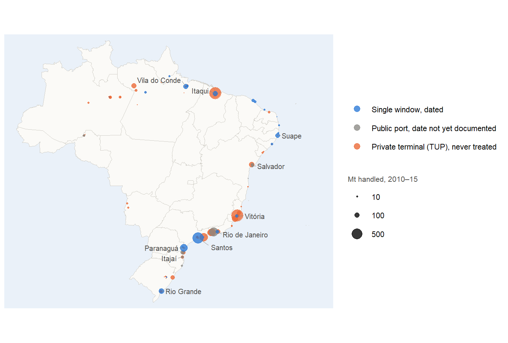
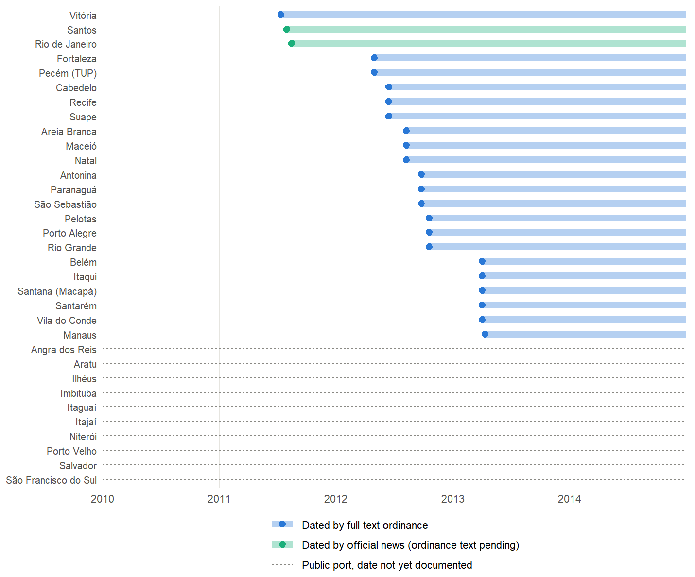
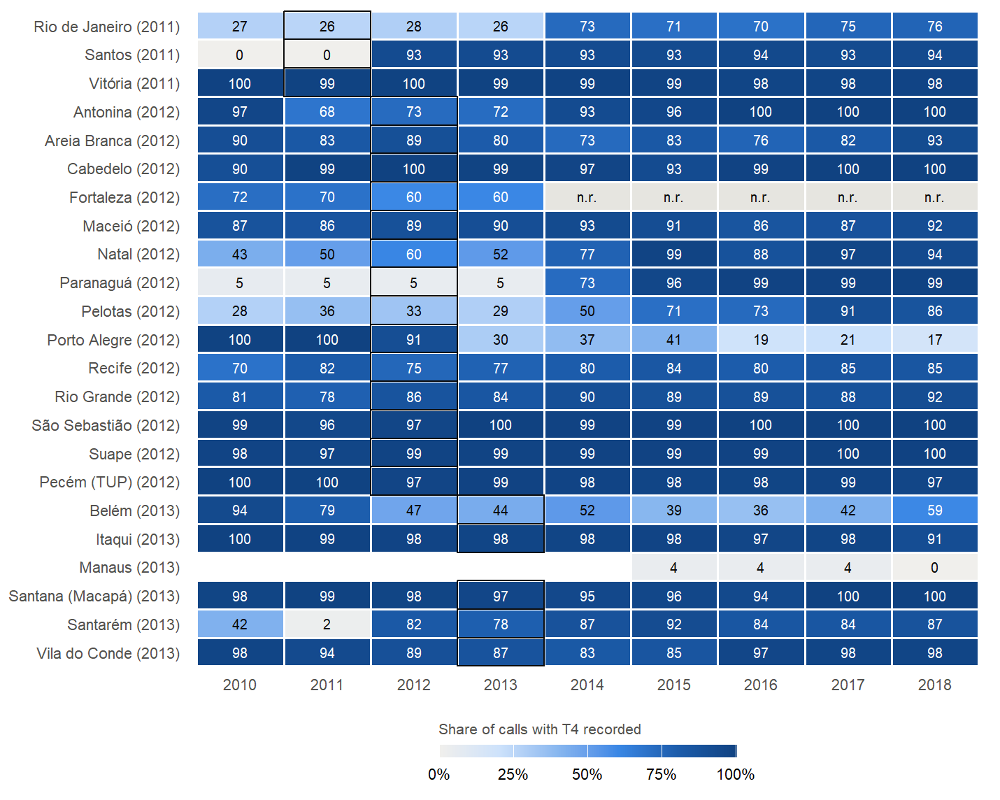
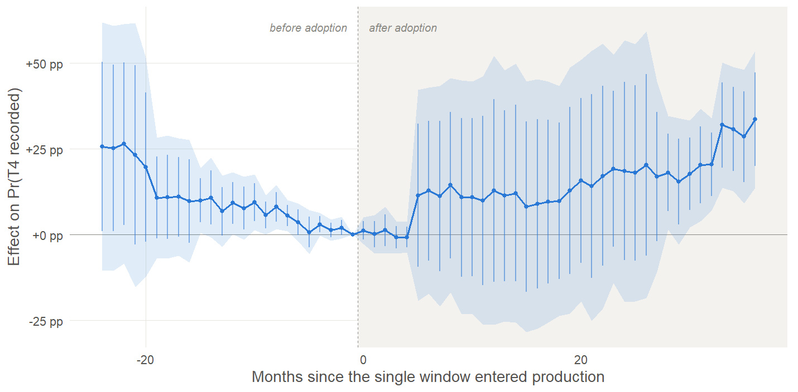
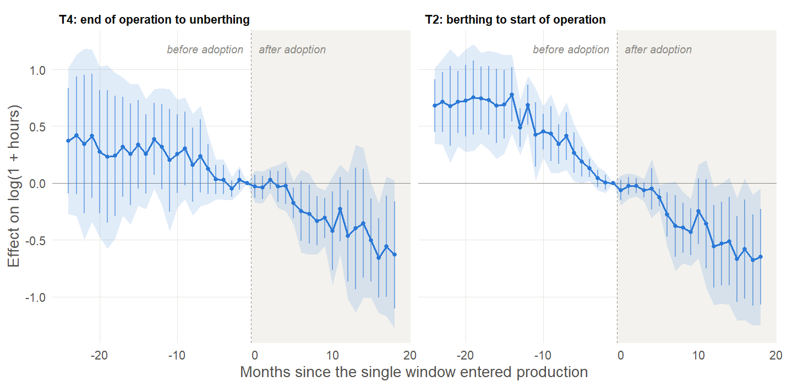
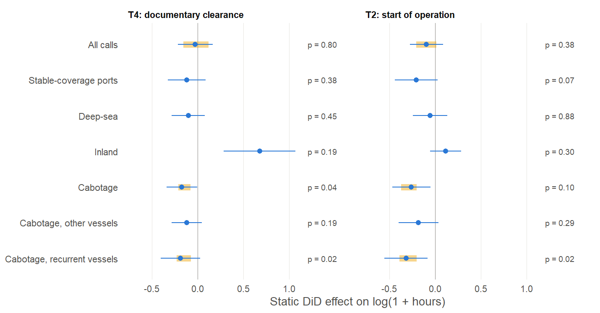
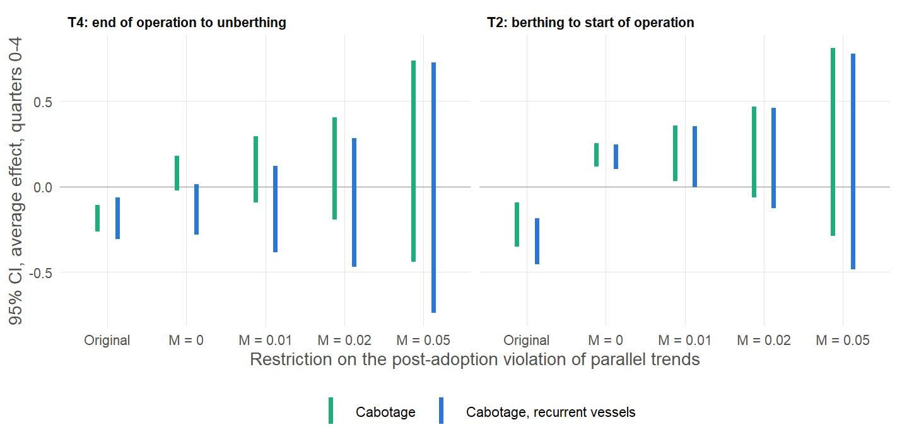

# Brazilian Port Digital Transformation Observatory

**Port digitalization, information quality and operational times: evidence from Brazil's *Porto Sem Papel* single window**

> [!WARNING]
> **Work in progress.** This is a research compendium under active development.
> Results, figures and text are **preliminary, not peer reviewed and may change
> without notice**. Please do not cite the numbers as final findings.
>
> **© 2026 Valber Gregory. All rights reserved.** The repository is public for
> transparency and reproducibility review only; see [LICENSE](LICENSE) and
> [LICENSING.md](LICENSING.md). Citation is welcome ([how to cite](#how-to-cite)).
>
> **Trabalho em andamento — todos os direitos reservados.** Resultados
> preliminares, sem revisão por pares; sujeitos a mudança. Veja [LICENSE](LICENSE).

<p align="center">
  
</p>

## What this is

Between July 2011 and April 2013, Brazil made the *Porto Sem Papel* (PSP)
maritime single window mandatory, port by port. This project combines

- **1.18 million commercial vessel calls with cargo** (ANTAQ waterway statistics, 2010–2026),
- **foreign-trade flows with observed freight costs** (Comex Stat, 2010–2026), and
- a **curated registry of the adoption dates**, read from the full text of the
  ordinances in the Official Gazette (DOU): 23 ports dated, 21 with high confidence,

into a reproducible information system (DuckDB + R) and a staggered
difference-in-differences evaluation of what the single window changed.

**Preliminary reading (subject to change):** the clearest change is in *what
the state records*, not in how long ships wait. In Santos, the share of vessel
calls with the post-operation waiting time recorded jumps from 0 % to 93 % with
the single window; across all adopting ports, however, the average change in
recording is not robust, so this is a case rather than a programme-wide effect.
Aggregate waiting times do not move. The apparent documentary effect for
cabotage vessels continues a pre-existing downward trend and disappears once
port-specific trends are allowed (HonestDiD and trend-adjusted DiD).

## Gallery

| Staggered adoption, dated from official acts | Recording of $T_4$ by port and year |
|---|---|
|  |  |
| **Event study: probability that $T_4$ is recorded** | **Event study: recurrent cabotage vessels** |
|  |  |
| **Estimates by sample, with Lee bounds** | **Sensitivity to pre-adoption trends (HonestDiD)** |
|  |  |

Event studies: Sun–Abraham estimator, port and month fixed effects, standard
errors clustered by port; shaded bands are 95 % uniform (sup-*t*) bands, thin
lines pointwise 95 % intervals.

## Reproducing the results (R)

Everything in the manuscript — every table, figure and every number quoted in
the text (`article/latex/numbers.tex`) — is produced by one `targets` pipeline.
No number is typed by hand.

**1. Environment** (R 4.4.3; packages pinned in `renv.lock`)

```r
# from the project root
renv::restore()                          # recreates the exact package library
source("scripts/00_check_environment.R") # checks R, packages, DuckDB, LaTeX
```

**2. Raw data** (public sources, not redistributed; each download is logged with
URL, date and SHA-256 in `data/metadata/download_log.csv`)

| Source | File | How |
|---|---|---|
| ANTAQ waterway statistics 2010–2026 | `data/raw/antaq/estatistico.zip` (909 MB) | `R/03_download_antaq.R` |
| Comex Stat (NCM, imports and exports) | `data/raw/comex/*.csv` | `R/04_download_comex.R` + `python/validate_downloads.py` |
| IBGE state boundaries 2024 | `data/raw/ibge/BR_UF_2024.zip` (14.7 MB) | URL in `download_log.csv` |
| PSP ordinances (DOU) | versioned registry `data/metadata/psp_portarias_dou.csv` | `python/scan_dou_legacy.py` |

**3. Pipeline**

```r
targets::tar_make()        # full rebuild (~50 min on a laptop once DuckDB is built)
targets::tar_outdated()    # what is out of date
targets::tar_visnetwork()  # dependency graph
```

The DAG (`_targets.R`) runs `scripts/09` → `27` in dependency order: DuckDB
ingestion → descriptives → event studies and DiD at the vessel-call level →
few-cluster inference (wild cluster bootstrap, permutation) → coverage
(information-quality) results → heterogeneity, placebo and HonestDiD → Lee
bounds → pre-trend sensitivity → figures → tables and macros → `outputs/overleaf.zip`. Each script also
runs on its own (`Rscript scripts/NN_*.R`).

**4. Tests**

```r
testthat::test_dir("tests/testthat")   # registry, cohorts, sample rules, WCB/permutation
```
```bash
python -m pytest tests/python          # DOU ordinance parser
```

Full details, timings and known pitfalls: [`docs/reproducibility_guide.md`](docs/reproducibility_guide.md).
Non-obvious choices are dated in [`docs/decisions_log.md`](docs/decisions_log.md).

## Repository map

| Path | Content |
|---|---|
| `R/` | functions: data building, DiD models, inference, figure theme |
| `scripts/` | numbered, runnable steps orchestrated by `_targets.R` |
| `sql/` | DuckDB schema |
| `python/` | DOU mining and download validation |
| `data/metadata/` | versioned curated metadata (ordinances, crosswalk, reporting-gap registry, download log) |
| `article/latex/` | manuscript sources (Elsevier `elsarticle`, anonymised for review) |
| `app/` | Shiny observatory (`Rscript scripts/07_launch_dashboard.R`, port 4200) |
| `docs/` | protocol, data inventory, identification strategy, writing guide, gallery |

## How to cite

The work has not been published yet. If you need to refer to it, cite the
repository with its version and access date (metadata in [`CITATION.cff`](CITATION.cff);
GitHub's *Cite this repository* button produces APA and BibTeX):

> Gregory, V. (2026). *Brazilian Port Digital Transformation Observatory: Port
> Digitalization, Information Quality and Operational Times* (Version 0.2.0,
> work in progress) [Research compendium]. GitHub.
> https://github.com/valbergregory/Port-Digitalization-Observatory

```bibtex
@misc{gregory2026observatory,
  author       = {Gregory, Valber},
  title        = {Brazilian Port Digital Transformation Observatory: Port Digitalization,
                  Information Quality and Operational Times},
  year         = {2026},
  note         = {Version 0.2.0, work in progress. All rights reserved},
  howpublished = {\url{https://github.com/valbergregory/Port-Digitalization-Observatory}}
}
```

Once a paper or an archived release with a DOI exists, this section will point
to it.

## Em português

Compêndio de pesquisa sobre o *Porto Sem Papel*: 1,18 milhão de atracações comerciais da
ANTAQ, comércio exterior do Comex Stat com frete observado e datas de adoção
lidas nas íntegras das portarias do DOU. Tudo é reproduzível em R com
`renv::restore()` e `targets::tar_make()`. **Trabalho em andamento; resultados
preliminares; todos os direitos reservados.** Contato: valber.gregory@gmail.com
